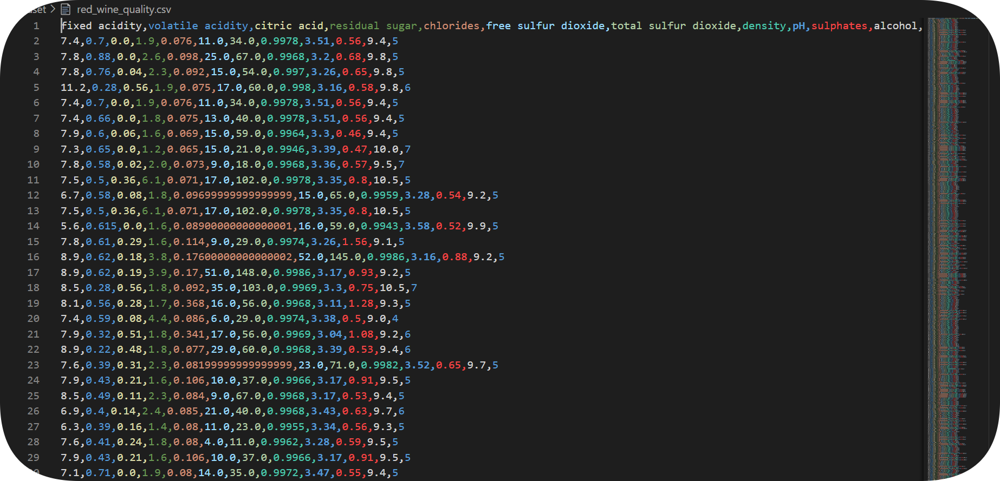
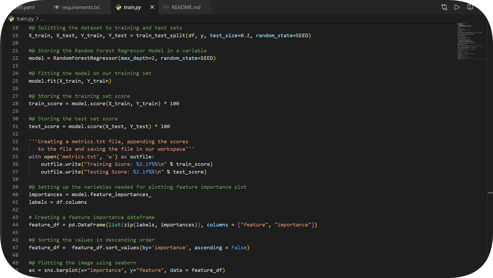
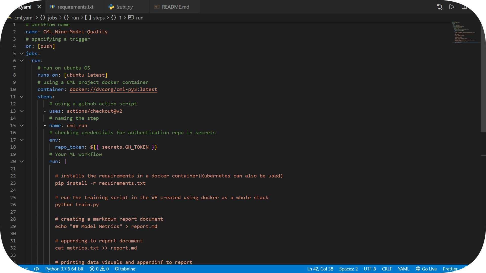
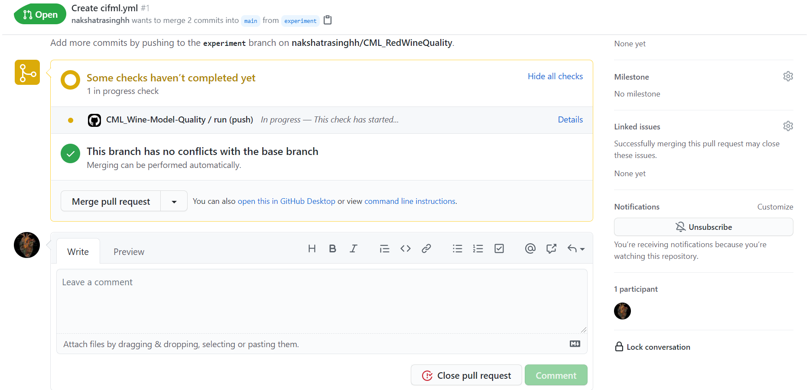
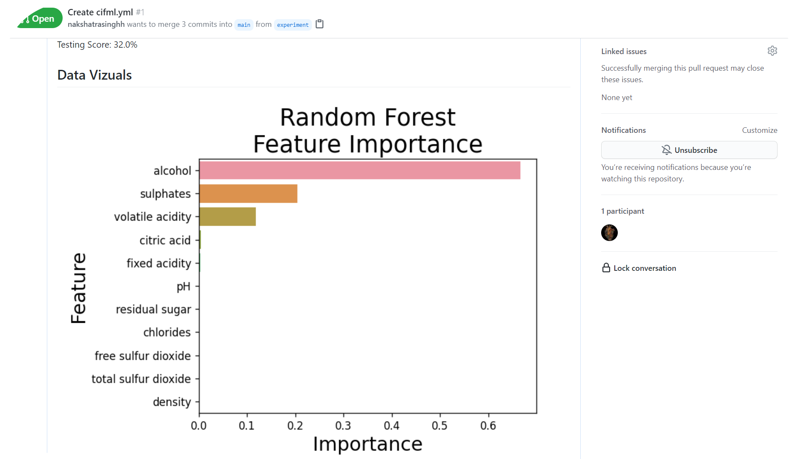

# Continuous Machine Learning 

**What is CML?** Continuous Machine Learning (CML) is an open-source library for
implementing continuous integration & delivery (CI/CD) in machine learning
projects. Use it to automate parts of your development workflow, including model
training and evaluation, comparing ML experiments across your project history,
and monitoring changing datasets.

## Dataset

For this project, I have used the [Red Wine Quality Dataset](https://www.kaggle.com/uciml/red-wine-quality-cortez-et-al-2009) from kaggle. This is a simple and clean practice dataset for regression and classification modelling. It consists of 1600 rows and 12 columns, it's a relatively small dataset, but good enough to under the posterior of this project. *On the side note, I used the [Rainbow CSV extension](https://marketplace.visualstudio.com/items?itemName=mechatroner.rainbow-csv) for VS-code to make .csv files look more attractive 😅*.

## Training Script

⚠️ All the necessary [packages](https://github.com/nakshatrasinghh/CML_RedWineQuality/blob/main/requirements.txt) must be installed using pip in order to train the model. ⚠️ _*Random Forest Regressor was used to build the model. Training and Testing scores were stored in a simple metrics.txt file and feature importances were saved in a .png file.*_ Detailed code of the training script with comments [here](https://github.com/nakshatrasinghh/CML_RedWineQuality/blob/main/train.py).

## Github Actions & Workflows

To use Github actions, you need to create a special .yaml/yml file in .github/workflows/ directory. This define the workflow of the project we want to specify when a particular trigger takes place. _In this case, a **[push]** in the repository _(irrespective of the branch) triggers the workflow._ Detailed code of the workflow with comments [here](https://github.com/nakshatrasinghh/CML_RedWineQuality/blob/main/.github/workflows/cifml.yml)

⚠️ **NOTE**: Make sure to create your own GitHub personal access token in the developer settings and name YOUR_SECRET_NAME as GH_TOKEN.*_You can name it anything you like, but make sure to change GH_TOKEN on line 18 in [cifml.yml](https://github.com/nakshatrasinghh/CML_RedWineQuality/blob/main/.github/workflows/cifml.yml) with YOUR_SECRET_NAME_.* ⚠️

An idea which is often hand in hand with continuous integration is using GitFlow. *_And the idea here is that whenever we want to experiment our project by adding something to our project, changing the parameters, etc, we're going to create a new branch in Git, and have the developement occur on that new branch._* And then ultimately can merge it into the main branch of our project.

## Pull Requests

Propose the new changes in a new branch or an exisiting branch (except main), create a pull request in that branch. The runner runs the workflow when a trigger is detected. A [runner](https://github.com/actions/runner) is a server that has the GitHub Actions runner application installed. You can use a runner hosted by GitHub, or you can host your own. ... For GitHub-hosted runners, each job in a workflow runs in a fresh virtual environment. GitHub-hosted runners are based on Ubuntu Linux, Microsoft Windows, and macOS. *_Initially, the runner sets up the jobs, initializes the [container](https://github.com/iterative/cml/blob/master/docker/Dockerfile) (CML docker in this case), runs the [script](https://github.com/actions/github-script) (Github actions checkout), runs the [workflow](https://github.com/nakshatrasinghh/CML_RedWineQuality/blob/main/.github/workflows/cifml.yml) we produced (in .yaml), post runs the [script](https://github.com/actions/github-script) (action checkout), stops the container, and finally completes the job._* All these steps are triggered on [push] (pushing a commit in the repo).

## Pull Request Conversations 

Whenever my collaborators propose some changes in the code, they can create a pull request in the experiment branch or any other, and a bot will display the Model Metrics and Data Visuals for the changes the collaborator proposed. As a team it can be cumbersome to run the training script locally every time you make changes in the code, with Github Actions this whole process is automated. So, whenever we make changes to the code, we get really fast feedback about what happened in an aesthetically pleasing format and it is easy for other team collaborators to look at/revisit it. You can see the report, go back to the commit that created that report and everything at that instance even in a closed pull request. This creates links between the code, the data, the environment, the infrastructure for training, and the results. 

